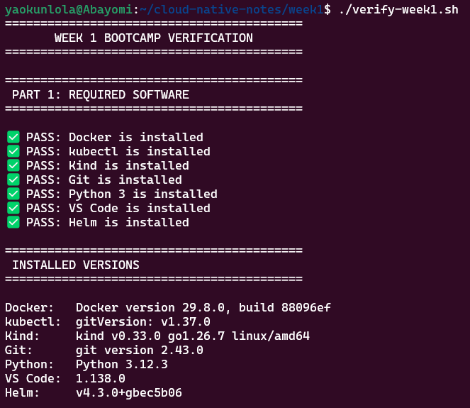
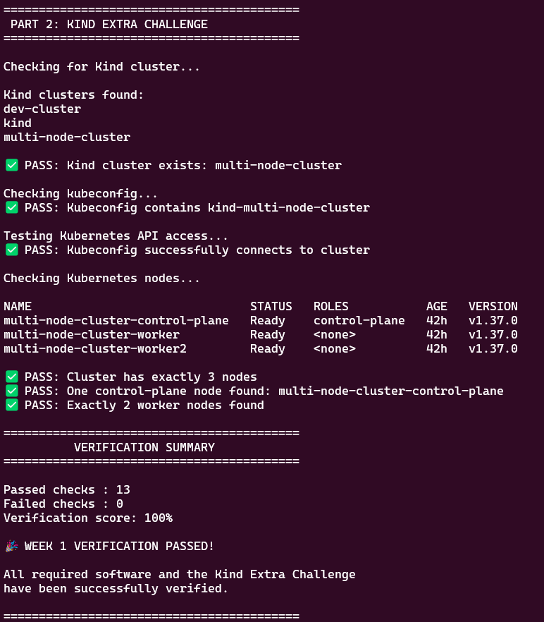

# Week 1 Challenge: Kind 3-Node Cluster Setup

A guide for creating a multi-node local Kubernetes cluster using Kind and configuring direct access via an exported kubeconfig file.

---

## Step 1: Create the 3-Node Kind Cluster

Kind uses a YAML manifest to define multi-node topologies.

1. Create a configuration file named `kind-config.yaml`:

   ```yaml
   kind: Cluster
   apiVersion: kind.x-k8s.io/v1alpha4
   nodes:
     - role: control-plane
     - role: worker
     - role: worker
   ```

2. Provision the cluster using this configuration:

   ```bash
   kind create cluster --name multi-node-cluster --config kind-config.yaml
   ```

---

## Step 2: Export and Verify Kubeconfig

By default, Kind merges the cluster context into `~/.kube/config`. To explicitly export it to an isolated file or point directly to it:

1. **Export to a standalone kubeconfig file:**

   ```bash
   kind get kubeconfig --name multi-node-cluster > ./kind-multi-node-cluster-kubeconfig.yaml
   ```

2. **Point your environment to the exported configuration:**

   * **Linux / macOS (Bash/Zsh):**

     ```bash
     export KUBECONFIG=$(pwd)/kind-multi-node-cluster-kubeconfig.yaml
     ```

   * **Windows (PowerShell):**

     ```powershell
     $env:KUBECONFIG = "$PWD\kind-multi-node-cluster-kubeconfig.yaml"
     ```

3. **Verify the 3 nodes are active:**

   ```bash
   kubectl get nodes
   ```

   You should see one node labeled `control-plane` and two labeled `<none>` (the worker nodes), all in the `Ready` state:

   ```text
   NAME                        STATUS   ROLES           AGE   VERSION
   multi-node-cluster-control-plane   Ready    control-plane   2m    v1.30.0
   multi-node-cluster-worker          Ready    <none>          90s   v1.30.0
   multi-node-cluster-worker2         Ready    <none>          90s   v1.30.0
   ```


## To Think About
- What is the use of each program installed?

| Tool | Primary Purpose |
| :--- | :--- |
| **Docker** | Container runtime engine. It builds, runs, and manages container images, and provides the underlying containerized infrastructure that Kind uses to simulate nodes. |
| **Kind (Kubernetes in Docker)** | A local Kubernetes testbed. It spins up full multi-node Kubernetes clusters where each cluster node runs inside a Docker container. |
| **kubectl** | The official CLI client for Kubernetes. It translates user commands into REST API calls to query and manage resources on the Kubernetes API server. |
| **Helm** | The package manager for Kubernetes. It packages multiple Kubernetes manifests into reusable "Charts," managing application releases, upgrades, and rollback states. |
| **Git** | Distributed version control system. It tracks code changes, facilitates collaboration, and forms the foundation for GitOps workflows. |
| **Python 3** | General-purpose scripting language commonly used in multi-nodeOps for automation scripts, testing pipelines, and interacting with cloud APIs. |
| **VS Code** | Code and configuration editor, featuring extensions for YAML formatting, Kubernetes cluster navigation, and Docker container inspection. |


## Verification

Run the verification script `./verify-week1.sh`



